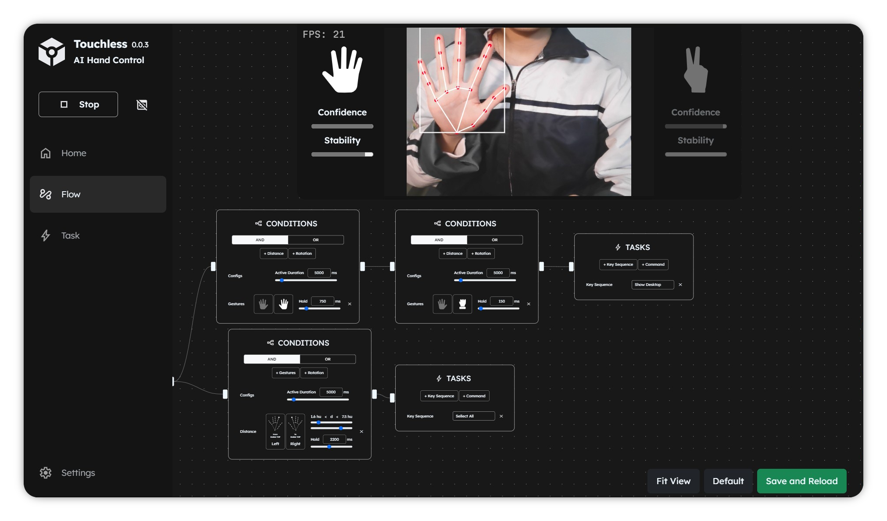

<h1 align="center"></h1>

<i>Control computer with hand gestures</i>

&nbsp;

  
  
  
  

&nbsp;

## 🔥 **Motivation**

This project was developed as part of a three-month challenge organized by the [JS Club](https://github.com/fu-js) at FPT University for new collaborators.

&nbsp;

## 🗺️ **Overview**

The goal of Touchless is to provide an alternative way to interact with computer.

By using hand tracking, gesture recognition and a node-based logic editor, the app allows for customizable actions such as switching slides during presentations or controlling simple games.

&nbsp;

## 💻 **Tech Stack & Features**

* **Framework:** Built with [Tauri](https://tauri.app/) and [Svelte](https://svelte.dev/).

* **Hand Tracking:** Uses the *MediaPipe Web API* for hand landmark estimation.
  
* **Gesture Recognition:** Custom classification model ([Gesture Classifier](https://github.com/ForeverWeLearn/gesture-classifier/)).

* **Customizable Logic:** A node-based editor allows users to creating custom logic (e.g., mapping a hand wave to the "Space" key).

&nbsp;

## 🌨️ **Project Status**

This project has been discontinued and is now a public archive.

While development has ceased due to the team's academic and professional commitments, the source code remains available for educational purposes and as a record of the team's collaborative work.

&nbsp;

## 🚀 **Downloads**

Although the project is archived, you can still download the compiled versions from the GitHub releases:

* **Latest (v0.1.2):** [Download here](https://github.com/ForeverWeLearn/Touchless/releases/tag/v0.1.2)  
* **Proof of Concept (PyQt):** [Download here](https://github.com/ForeverWeLearn/Touchless-PyQt/releases/tag/v0.0.1)

&nbsp;

## 👨‍💻 **Development Team**

The project was a collaboration by first and second-year students, supported by mentors from the JS Club.

### **Mentors & Support**

* **Nguyễn Tuấn Vũ** (Mentor)

* **Phạm Vũ Thái Minh** (Takecare)

* **Nguyễn Huy Hào** (Takecare)

* **Trần Ngọc Huy** (Takecare)

* **Nguyễn Thanh Mai** (Takecare)

### **Core Team**

* [**Nguyễn Thế Anh**](https://github.com/ForeverWeLearn) (Leader – App, AI Dev)

* [**Ngô Đức Lương**](https://github.com/Natlife) (Fullstack Dev)

* [**Phan Nguyễn Trường Sơn**](https://github.com/PhanNTSon) (Fullstack Dev)

* [**Ngô Thương Huyền**](https://github.com/thuonghuyenn) (Frontend Dev)

* [**Tăng Toàn Thắng**](https://github.com/Cahoii) (Frontend Dev)

* [**Chung Văn Duy**](https://github.com/Pain3706) (Backend Dev)

&nbsp;

## 🔗 **Related Links**

* Landing Page (unmaintained): [Live Demo](https://landing-page-touchless.vercel.app/)

* Landing Page Repository: [GitHub](https://github.com/Natlife/landing-page-touchless)

* Gesture Classifier Model: [GitHub](https://github.com/ForeverWeLearn/gesture-classifier/)

* Original PoC (PyQt Version): [Touchless-PyQt](https://github.com/ForeverWeLearn/Touchless-PyQt/)

&nbsp;

&nbsp;

<i>Developed with passion by <strong>Team 3 Gen 12 - JS Club</strong></i>

